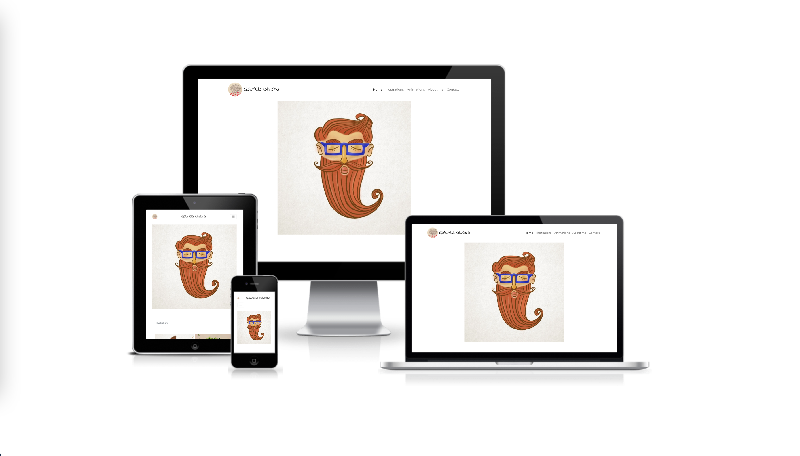

# Illustrator-portfolio

Portfolio project, using HTML, Bootstrap and Css

## Deployment

- The website was deployed on a the Github Pages website.
The live link can be found here - https://gabrielaoliveirabpt.github.io

## Credits

- The icons in the footer were taken from [Font Awesome](https://fontawesome.com/)
- The responsive devices image was taken from the website [Am I Responsive](http://ami.responsivedesign.is/)

